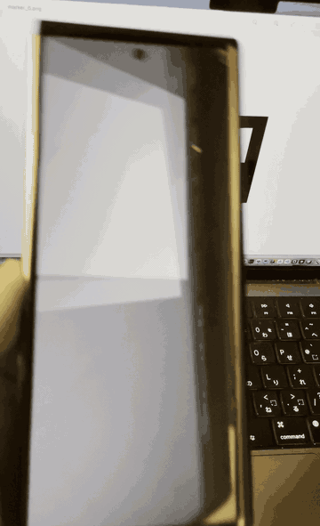

# OpenCV+Unity

Unity で使える OpenCV ネイティブプラグインです。**OpenCV 4.11** をベースに、C# ラッパーである **OpenCvSharp 4.11** のマネージド層とネイティブラッパー（`OpenCvSharpExtern`）をビルドし、UPM パッケージとして配布します。

macOS / iOS / Android / Windows / Linux 向けに、実機でも動くネイティブプラグイン一式を CI で自動ビルドしています。



## 背景・由来

このプロジェクトは、**無料で公開された OpenCV プラグイン「OpenCV plus Unity」** を元にしています。

- 元となったプロジェクト（無料版）: <https://github.com/Gobra/OpenCV-Unity>
- その上で、C# ラッパーとして **OpenCvSharp** の **OpenCV 4.11 ベース版** に追従しています。
  - <https://github.com/shimat/opencvsharp>（タグ `4.11.0.20250507` に固定）

つまり「OpenCV plus Unity」（Gobra/OpenCV-Unity）が提供していた **Unity ⇔ OpenCV のテクスチャ変換・例外伝搬・マネージド層の Unity 適応**という考え方を引き継ぎつつ、**OpenCV / OpenCvSharp を 4.11 へ更新**し、現行 Unity（6000.x）でビルド・検証できるようにしたものです。

## 特徴

- **OpenCV 4.11 + OpenCvSharp 4.11** をベースにした、最新のネイティブプラグイン
- **マルチプラットフォーム**（macOS / iOS / Android / Windows / Linux）向けにプリビルド
- **UPM パッケージ**（`com.opencvplus.unity`）として配布し、`Packages/manifest.json` から簡単に参照
- **Unity 向けマネージド層の適応**:
  - `NativeMethods.DllExtern` は iOS で `__Internal`（静的 `.a` をプレイヤーにリンク）
  - ネイティブ例外を `redirectError` + `HandleException` で Unity でも伝搬
  - `GlobalUsings.cs` で upstream の `ImplicitUsings` 前提を Unity でも等価実現
  - `OpenCvSharp.asmdef` でマネージド層を自前アセンブリに分離
- **AR マーカーデモ**（ArUco）を含む検証用サンプルを `verify/` に同梱

## 構成

```
OpenCvPlusUnity/
├── source/
│   └── opencvsharp/          # OpenCvSharp 4.11.0.20250507（サブモジュール）
│       ├── opencv/           # OpenCV 4.11 ソース（自動 checkout）
│       └── opencv_contrib/   # OpenCV contrib 4.11（自動 checkout）
├── Utils/                    # ビルド・パッケージングスクリプト
│   ├── build.sh              # OpenCV + OpenCvSharpExtern のビルドオーケストレータ
│   ├── build-opencv.sh       # OpenCV 本体のビルド
│   ├── build-extern.sh       # OpenCvSharpExtern のビルド
│   ├── package-unity.sh      # UPM パッケージ化（cs11ify + plugins + templates）
│   ├── prune-extern.sh       # extern ソースから CUDA を除去
│   ├── cs11ify.py            # OpenCvSharp の C#12 → C#11 書き換え
│   ├── opencv_options_unity.cmake
│   └── patches/              # ローカルパッチ（ビルド時自動適用）
├── Unity/OpenCV+Unity/       # UPM パッケージ本体（com.opencvplus.unity）
│   └── Runtime/              # マネージド C# + ネイティブプラグイン
├── verify/UnityProject/      # 検証用 Unity プロジェクト（EditMode テスト / AR デモ）
└── bin/OpenCvSharpExtern-1.0/# ビルド成果物（各プラットフォーム）
```

## 要件

- **Unity 6000.x**（検証は `6000.3.10f1` で実施。Unity 2022 は display 初期化の問題で非サポート）
- **macOS**: Apple Silicon（arm64）のみ / **iOS**: arm64 / **Android**: arm64-v8a, API 35, NDK 28+ / **Windows**: x86_64 / **Linux**: x86_64
- ビルドに必要なもの:
  - CMake 3.5+（OpenCV の `cmake_minimum_required` を 3.5 に引き上げたローカルパッチを適用）
  - Android ビルドには `ANDROID_NDK` に NDK 28+（Android 15 の 16KB page-size 対応）のパスが必要
  - Eigen3（OpenCV の `Eigen3::Eigen` ターゲット）

## ビルド

ネイティブプラグインのビルドと UPM パッケージ化:

```bash
# 1. OpenCV + OpenCvSharpExtern をビルド（macos / ios / android / windows / linux）
ANDROID_NDK=$HOME/Library/Android/sdk/ndk/28.2.13676358 bash Utils/build.sh macos ios android

# 2. 成果物を UPM パッケージ（Unity/OpenCV+Unity/）にステージ
bash Utils/package-unity.sh 1.0
```

### GitHub Actions

`.github/workflows/build.yml` で、タグ `v*` の push 時に全プラットフォームをビルドし、UPM パッケージを tarball として **GitHub Release** に自動公開します。

## Unity プロジェクトでの利用

### Installation

1. **Window > Package Manager** を開く
2. **"+"** ボタン > **Add package from git URL** を選ぶ
3. 次の URL を入力する:

```
https://github.com/neon-izm/OpenCV-plus-Unity.git?path=/Unity/OpenCV+Unity
```

または `Packages/manifest.json` の `dependencies` に追加します:

```json
{
  "dependencies": {
    "com.opencvplus.unity": "https://github.com/neon-izm/OpenCV-plus-Unity.git?path=/Unity/OpenCV+Unity"
  }
}
```

利用側は `Assets/csc.rsp` も必要です:

```
-unsafe
-langversion:latest
```

## 検証

- `verify/UnityProject` に検証用 Unity プロジェクトを同梱しています。
- EditMode テストで OpenCV 関数の動作を検証しています（現状 53/53 グリーン）。
- **AR マーカーデモ**: `verify/UnityProject/Assets/Scenes/ARMarkerDemo.unity` を開き、`Assets/Markers/marker_0.png` を印刷してカメラに向けると、マーカー上にオブジェクトが表示されます（ArUco / `OpenCvSharp.Aruco`）。

## ライセンス

- 本プロジェクトの配布物（UPM パッケージ）は **Apache-2.0**（`Unity/OpenCV+Unity/package.json` を参照）。
- OpenCV は **Apache-2.0**、OpenCvSharp は **Apache-2.0** です。詳細は各プロジェクトのライセンスをご確認ください。
